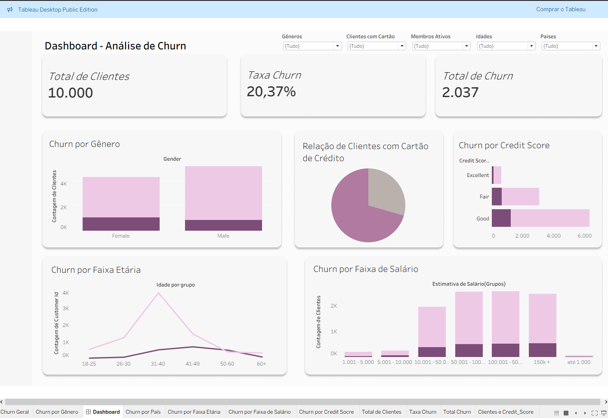

# Análise de Churn Dashboard - Tableau

Este repositório contém uma análise de churn de clientes desenvolvida como parte de uma atividade prática de análise de dados.

## 📊 Dashboard no Tableau Public
O dashboard interativo pode ser acessado no link abaixo:

🔗 [https://public.tableau.com/app/profile/ana.l.via.abrah.o/viz/Dashboard-Churn/Dashboard]

🔗 [https://public.tableau.com/app/profile/ana.l.via.abrah.o/viz/Dashboard2-churn/Painel1]

## Objetivo da Análise
Analisar padrões de comportamento dos clientes associados ao churn, identificando fatores relevantes que impactam a retenção.

##  Principais Insights
- Aproximadamente 20% dos clientes analisados cancelaram o serviço, indicando uma taxa de churn relevante, com potencial impacto direto nos resultados da instituição financeira.
- Embora a base de clientes seja majoritariamente masculina, o churn é proporcionalmente maior entre as mulheres, sugerindo diferenças no comportamento ou na experiência do cliente por gênero.
- A Alemanha apresenta a maior taxa proporcional de churn, mesmo não sendo o país com maior volume de clientes, o que indica possíveis variações regionais na percepção de valor ou qualidade do serviço.
- O churn aumenta significativamente a partir dos 40 anos, com destaque para a faixa entre 50 e 60 anos, onde a evasão supera a retenção, enquanto clientes mais jovens tendem a permanecer ativos.
- A análise por renda mostra que o salário, isoladamente, não é determinante para o churn, porém clientes de renda média e alta apresentam maior propensão à evasão, sugerindo maior sensibilidade a benefícios, taxas e qualidade dos serviços.
- Clientes com bom score de crédito também apresentam taxas elevadas de churn, reforçando a hipótese de um público mais exigente e atento a vantagens competitivas.
- Observa-se que clientes com apenas um produto contratado tendem a abandonar mais rapidamente a instituição, o que pode indicar uma experiência inicial insatisfatória ou baixa estratégia de engajamento e cross-sell.

## Ferramentas Utilizadas
- Tableau Desktop / Tableau Public
- GitHub para versionamento e documentação

## 📁 Dados
O dataset utilizado foi fornecido para fins educacionais. Caso não esteja disponível publicamente, este repositório contém apenas a estrutura da análise.
